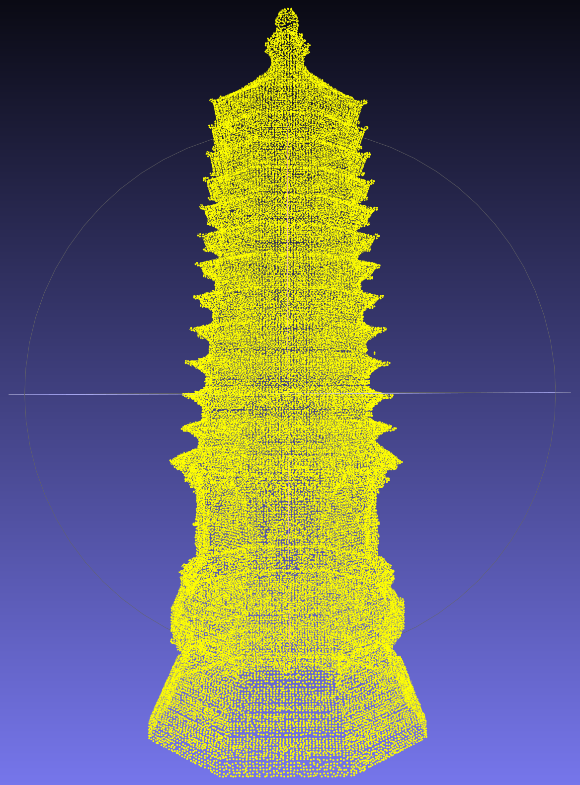

# Hebei_Pagodas_pointcloud
一个关于河北省古塔的点云数据集

***
## 关于数据集
古塔点云数据由张家口市建筑文化遗产保护与传承数字化重点实验室测绘，相关成果已出版（[《中国古塔数字化测绘图集·河北卷》](https://www.cabplink.com/commodity-details?productCode=9445451743402)，中国建筑工业出版社，2024）。

- 43座古塔的点云数据
- 体素网格下采样处理
- 尺度归一化
***
## 下载地址
[Hebei_Pagodas_pointcloud](https://drive.google.com/file/d/1NqT09n-y4Xl8pBdgjBFVYo2gPD7vTg7g/view?usp=sharing)
